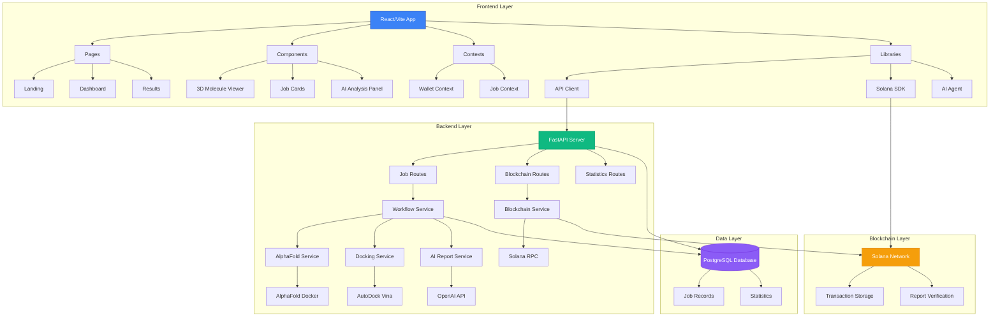
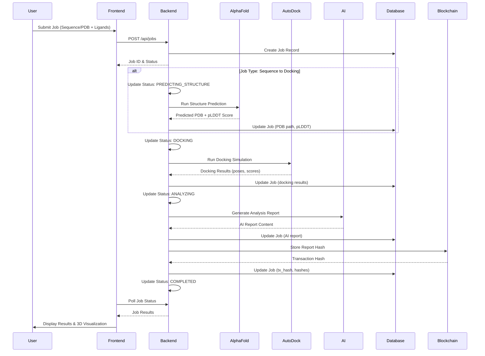
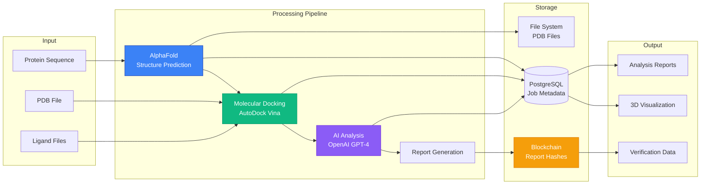
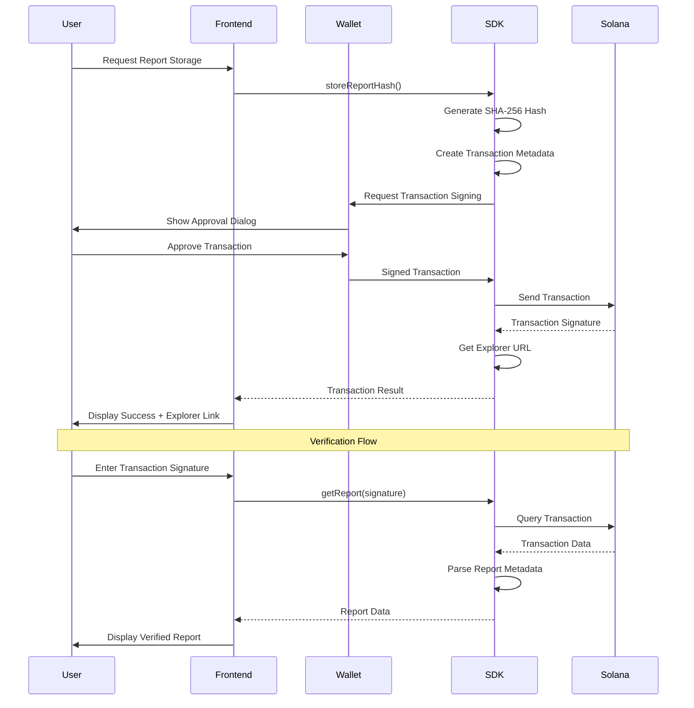
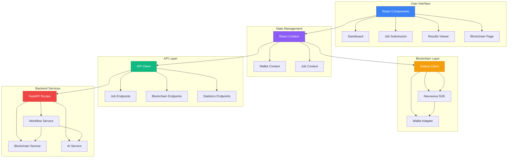
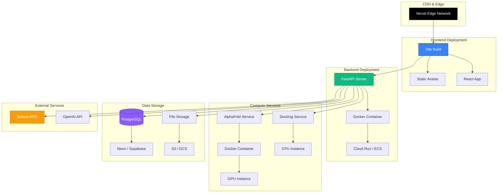

# SNOWFLAKE - Molecular Docking Platform with Blockchain Verification

A modern, full-stack SaaS platform for molecular docking simulations with AI-powered analysis and Solana blockchain verification.

## 🚀 Features

### Core Platform
- **Modern Landing Page**: Responsive design with hero, features, testimonials, and pricing sections
- **Multi-Page Navigation**: About, Contact, Dashboard, Login/Signup pages
- **Molecular Docking Dashboard**: Submit and manage docking jobs with real-time status updates
- **3D Molecular Visualization**: Interactive protein-ligand structure viewing using 3Dmol.js
- **AI-Powered Analysis**: Comprehensive molecular interaction analysis with stakeholder-specific insights

### AI Capabilities
- **Stakeholder-Specific Reports**: Tailored analysis for researchers, investors, regulators, and clinicians
- **Binding Affinity Analysis**: Detailed scoring and interaction predictions
- **Drug-Likeness Evaluation**: Lipinski's Rule of Five and ADMET properties
- **Toxicity Assessment**: Safety profile and risk evaluation
- **Cost Estimation**: AI analysis pricing with confidence scoring

### Blockchain Integration
- **Solana Storage**: Immutable report storage on Solana blockchain
- **Phantom Wallet**: Seamless wallet connection and transaction signing
- **Report Verification**: Verify any report using transaction signatures
- **Audit Trail**: Complete transaction history with Solana Explorer integration
- **Low Cost**: ~0.000005 SOL per transaction on devnet/testnet/mainnet

## 🏗️ Architecture

### System Architecture



### Complete Workflow



### Data Flow Architecture



### Blockchain Integration Flow



### Component Interaction Diagram



### Architecture Diagrams Overview

The diagrams above illustrate different aspects of the SNOWFLAKE platform:

1. **System Architecture**: High-level overview of all system components and their relationships across frontend, backend, data, and blockchain layers.

2. **Complete Workflow**: Step-by-step sequence diagram showing the entire job processing pipeline from user submission through AlphaFold prediction, docking, AI analysis, and blockchain storage.

3. **Data Flow Architecture**: Visual representation of how data moves through the system from input (sequences/files) through processing (prediction/docking/AI) to storage and output.

4. **Blockchain Integration Flow**: Detailed interaction flow for storing reports on Solana blockchain, including wallet signing and verification processes.

5. **Component Interaction Diagram**: Shows how frontend components, state management, API layer, and blockchain services interact with backend services.

6. **Deployment Architecture**: Infrastructure diagram showing how the application is deployed across CDN, compute services, and data storage layers.

## 🛠️ Tech Stack

### Frontend
- **Framework**: React 19 + Vite
- **Language**: TypeScript
- **Styling**: Tailwind CSS v3
- **UI Components**: Radix UI + shadcn/ui
- **Icons**: Lucide React
- **3D Visualization**: 3Dmol.js
- **State Management**: React Context + React Query
- **Routing**: React Router v7

### Blockchain
- **Network**: Solana
- **Wallet**: Phantom Wallet Adapter
- **SDK**: Custom Neuraviva SDK
- **Library**: @solana/web3.js

### AI & Analysis
- **AI Integration**: OpenAI GPT-4, Anthropic Claude
- **Analysis Types**: Binding affinity, drug-likeness, toxicity
- **Report Generation**: Multi-stakeholder PDF/HTML/JSON reports

## 📦 Installation

### Prerequisites
- Node.js 18+ 
- npm or yarn
- Phantom Wallet (browser extension)

### Setup

1. **Clone the repository**
```bash
git clone <repository-url>
cd snowflake
```

2. **Install dependencies**
```bash
npm install
```

3. **Configure environment variables**
```bash
cp .env.local.example .env.local
```

Edit `.env.local`:
```env
# Solana Configuration
VITE_SOLANA_NETWORK=devnet

# API Configuration
VITE_API_URL=http://localhost:8000

# WebSocket Configuration
VITE_WS_URL=ws://localhost:8000
```

4. **Run development server**
```bash
npm run dev
```

5. **Open browser**
Navigate to `http://localhost:3000`

## 🔗 Blockchain Setup

### 1. Install Phantom Wallet
Download from [phantom.app](https://phantom.app)

### 2. Switch to Devnet
In Phantom:
- Settings → Change Network → Devnet

### 3. Get Test SOL
- Connect wallet on the Blockchain page
- Click "Request Airdrop" to get 1 SOL for testing

### 4. Store a Report
- Generate a report on the Dashboard
- Enable "Store on Solana Blockchain"
- Approve the transaction in Phantom
- View transaction on Solana Explorer

## 📚 Usage Guide

### Molecular Docking Workflow

1. **Navigate to Dashboard**
   - Click "Dashboard" in the header or hero CTA

2. **Submit a Docking Job**
   - Click "Submit New Job"
   - Upload protein (PDB) and ligand (SDF/MOL2) files
   - Configure docking parameters
   - Submit job

3. **Monitor Progress**
   - View real-time job status
   - See progress indicators
   - Wait for completion

4. **View Results**
   - Click on completed job
   - Explore 3D molecular visualization
   - Review binding poses and scores

5. **Generate AI Analysis**
   - Select analysis type (binding, drug-likeness, toxicity)
   - Choose stakeholder perspective
   - Run analysis with AI

6. **Create Reports**
   - Select stakeholder type (researcher/investor/regulator/clinician)
   - Choose format (PDF/HTML/JSON)
   - Enable blockchain storage (optional)
   - Generate and download report

7. **Verify on Blockchain**
   - Navigate to Blockchain page
   - Enter transaction signature
   - View complete report metadata
   - Verify on Solana Explorer

## 🔐 Security Features

### Wallet Security
- Private keys never leave Phantom wallet
- All transactions require explicit user approval
- Secure transaction signing

### Data Integrity
- SHA-256 cryptographic hashing
- Immutable blockchain storage
- Tamper-proof audit trails

### Report Verification
- Anyone can verify report authenticity
- Complete transaction history
- Transparent data provenance

## 📊 API Reference

### SolanaClient

```typescript
// Get wallet balance
const balance = await solanaClient.getBalance(publicKey)

// Store report on blockchain
const result = await solanaClient.storeReportWithSDK(wallet, {
  jobId: "job_123",
  reportContent: content,
  reportType: "pdf",
  stakeholder: "researcher",
  metadata: { version: "1.0" }
})

// Verify report
const reportData = await solanaClient.getReportData(signature)

// Request devnet airdrop
await solanaClient.requestAirdrop(publicKey, 1)
```

### AI Agent

```typescript
// Run AI analysis
const analysis = await analyzeWithAI({
  jobId: "job_123",
  analysisType: "binding_affinity",
  stakeholder: "researcher",
  prompt: "Analyze binding interactions"
})

// Generate stakeholder report
const report = await generateStakeholderReport({
  jobId: "job_123",
  stakeholder: "investor",
  format: "pdf"
})
```

## 🎨 Design System

### Color Palette
- **Primary**: Slate Blue (#475569)
- **Accent**: Blue (#3b82f6)
- **Success**: Green (#22c55e)
- **Warning**: Orange (#f97316)
- **Error**: Red (#ef4444)

### Typography
- **Headings**: Geist Sans
- **Body**: Geist Sans
- **Code**: Geist Mono

### Components
Built with shadcn/ui and Radix UI for accessibility and consistency

## 📈 Stakeholder-Specific Features

### For Researchers
- Technical methodology details
- Statistical analysis
- Peer-review ready reports
- Citation-ready data

### For Investors
- Market opportunity analysis
- ROI projections
- Development timeline
- Risk assessment

### For Regulators
- Safety documentation
- Compliance verification
- Audit trails
- Regulatory submission support

### For Clinicians
- Therapeutic potential
- Patient safety profile
- Clinical relevance
- Treatment implications

## 🚢 Deployment

### Frontend Deployment (Vercel/Netlify)

1. **Connect Repository**
   - Import project on Vercel/Netlify
   - Connect GitHub repository

2. **Configure Environment**
   - Add environment variables
   - Set `VITE_SOLANA_NETWORK=devnet`
   - Set `VITE_API_URL` to your backend URL

3. **Deploy**
   - Automatic deployment on push
   - Preview deployments for PRs

### Backend Deployment (Docker)

1. **Build Docker Image**
   ```bash
   docker build -t snowflake-backend ./backend
   ```

2. **Run Container**
   ```bash
   docker run -p 8000:8000 \
     -e DATABASE_URL=your_db_url \
     -e SOLANA_RPC_URL=your_rpc_url \
     snowflake-backend
   ```

3. **Deploy to Cloud**
   - Google Cloud Run
   - AWS ECS/Fargate
   - Azure Container Instances

### Environment Variables
```env
VITE_SOLANA_NETWORK=devnet
VITE_API_URL=https://api.snowflake.com
VITE_WS_URL=wss://api.snowflake.com
```

### Deployment Architecture



## 📖 Documentation

- [Solana Integration Guide](docs/SOLANA_INTEGRATION.md)
- [API Documentation](docs/API.md)
- [Component Library](docs/COMPONENTS.md)

## 🤝 Contributing

1. Fork the repository
2. Create feature branch (`git checkout -b feature/amazing-feature`)
3. Commit changes (`git commit -m 'Add amazing feature'`)
4. Push to branch (`git push origin feature/amazing-feature`)
5. Open Pull Request

## 📝 License

This project is licensed under the MIT License.

## 🙏 Acknowledgments

- **Solana Foundation** - Blockchain infrastructure
- **Phantom Wallet** - Wallet integration
- **shadcn/ui** - UI component library
- **Radix UI** - Accessible primitives
- **3Dmol.js** - Molecular visualization
- **AutoDock Vina** - Docking engine
- **OpenAI** - AI analysis capabilities

## 📞 Support

For support and questions:
- Email: support@snowflake.com
- Documentation: https://docs.snowflake.com
- Community: https://discord.gg/snowflake

## 🗺️ Roadmap

- [ ] Multi-signature verification
- [ ] Batch report storage
- [ ] Advanced metadata search
- [ ] Report versioning on-chain
- [ ] NFT generation for milestone reports
- [ ] DAO governance for validation
- [ ] Integration with more docking engines
- [ ] Support for additional blockchains
- [ ] Mobile application
- [ ] API marketplace

---

Built with ❤️ by the SNOWFLAKE team
